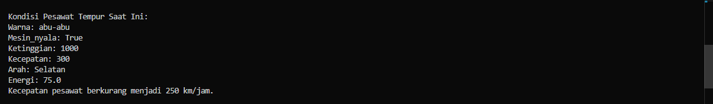

# Data pesawat tempur
pesawat_tempur = {
    "warna": "abu-abu",
    "mesin_nyala": True,  # Mesin sudah dinyalakan
    "ketinggian": 1000,   # dalam meter
    "kecepatan": 200,     # dalam km/jam
    "arah": "Selatan",    # arah
    "energi": 80          # dalam persentase
}

# Fungsi untuk menyalakan mesin pesawat
def nyalakanMesin(pesawat):
    if pesawat["energi"] > 0:
        # Cek jika mesin tidak nyala menggunakan '!= True'
        if pesawat["mesin_nyala"] != True:
            pesawat["mesin_nyala"] = True
            print("Mesin pesawat dinyalakan.")
        else:
            print("Mesin sudah menyala.")
    else:
        print("Energi tidak cukup untuk menyalakan mesin.")

# Fungsi untuk menaikkan ketinggian pesawat
def terbang(pesawat, kenaikan_ketinggian):
    # Periksa apakah mesin pesawat sudah menyala
    if not pesawat["mesin_nyala"]:
        print("Mesin belum dinyalakan. Tidak bisa terbang.")
        return  # Keluar dari fungsi jika mesin belum menyala
    
    # Periksa apakah energi cukup untuk terbang
    if pesawat["energi"] < kenaikan_ketinggian * 0.1:
        print("Energi tidak cukup untuk terbang.")
        return  # Keluar dari fungsi jika energi tidak cukup
    
    # Tambah ketinggian pesawat
    pesawat["ketinggian"] += kenaikan_ketinggian
    # Kurangi energi sesuai dengan kenaikan ketinggian (misalnya 10% dari kenaikan ketinggian)
    pesawat["energi"] -= kenaikan_ketinggian * 0.1
    
    # Tampilkan pesan status pesawat setelah terbang
    print(f"Pesawat naik ke ketinggian {pesawat['ketinggian']} meter.")
    print(f"Energi tersisa: {pesawat['energi']}%")

# Fungsi untuk menurunkan ketinggian pesawat
def turun(pesawat, penurunan_ketinggian):
    # Periksa apakah mesin pesawat sudah menyala
    if not pesawat["mesin_nyala"]:
        print("Mesin belum dinyalakan. Tidak bisa menurunkan ketinggian.")
        return  # Keluar dari fungsi jika mesin belum menyala
    
    # Periksa apakah ketinggian saat ini cukup untuk turun
    if pesawat["ketinggian"] < penurunan_ketinggian:
        print("Ketinggian pesawat tidak cukup untuk turun sebanyak itu.")
        return  # Keluar dari fungsi jika ketinggian tidak cukup
    
    # Turunkan ketinggian pesawat
    pesawat["ketinggian"] -= penurunan_ketinggian
    
    # Tampilkan pesan status pesawat setelah turun
    print(f"Pesawat turun ke ketinggian {pesawat['ketinggian']} meter.")

# Fungsi untuk menambah kecepatan pesawat
def tambah_kecepatan(pesawat, tambahan_kecepatan):
    # Periksa apakah mesin pesawat sudah menyala
    if not pesawat["mesin_nyala"]:
        print("Mesin belum dinyalakan. Tidak bisa menambah kecepatan.")
        return  # Keluar dari fungsi jika mesin belum menyala
    
    # Periksa apakah energi cukup untuk menambah kecepatan
    if pesawat["energi"] < tambahan_kecepatan * 0.05:  # Misalnya, konsumsi energi 5% dari tambahan kecepatan
        print("Energi tidak cukup untuk menambah kecepatan.")
        return  # Keluar dari fungsi jika energi tidak cukup
    
    # Tambah kecepatan pesawat
    pesawat["kecepatan"] += tambahan_kecepatan
    # Kurangi energi sesuai dengan tambahan kecepatan
    pesawat["energi"] -= tambahan_kecepatan * 0.05
    
    # Tampilkan pesan status pesawat setelah menambah kecepatan
    print(f"Kecepatan pesawat bertambah menjadi {pesawat['kecepatan']} km/jam.")
    print(f"Energi tersisa: {pesawat['energi']}%")

# Fungsi untuk mengurangi kecepatan pesawat
def kurangi_kecepatan(pesawat, pengurangan_kecepatan):
    # Periksa apakah mesin pesawat sudah menyala
    if not pesawat["mesin_nyala"]:
        print("Mesin belum dinyalakan. Tidak bisa mengurangi kecepatan.")
        return  # Keluar dari fungsi jika mesin belum menyala
    
    # Periksa apakah kecepatan saat ini cukup untuk dikurangi
    if pesawat["kecepatan"] < pengurangan_kecepatan:
        print("Kecepatan pesawat tidak cukup untuk mengurangi sebanyak itu.")
        return  # Keluar dari fungsi jika kecepatan tidak cukup
    
    # Kurangi kecepatan pesawat
    pesawat["kecepatan"] -= pengurangan_kecepatan
    
    # Tampilkan pesan status pesawat setelah mengurangi kecepatan
    print(f"Kecepatan pesawat berkurang menjadi {pesawat['kecepatan']} km/jam.")

# Fungsi untuk mengubah arah pesawat
def belok(pesawat, arah_baru):
    # Periksa apakah mesin pesawat sudah menyala
    if not pesawat["mesin_nyala"]:
        print("Mesin belum dinyalakan. Tidak bisa mengubah arah.")
        return  # Keluar dari fungsi jika mesin belum menyala
    
    # Ubah arah pesawat
    pesawat["arah"] = arah_baru
    
    # Tampilkan pesan status pesawat setelah mengubah arah
    print(f"Pesawat sekarang mengarah ke {pesawat['arah']}.")
    
# Fungsi untuk mencetak kondisi terakhir pesawat
def cetak_kondisi_pesawat(pesawat):
    print("\nKondisi Pesawat Tempur Saat Ini:")
    for kunci, nilai in pesawat.items():
        print(f"{kunci.capitalize()}: {nilai}")

# Program Utama
if __name__ == "__main__":
    # Cetak kondisi terakhir pesawat
    cetak_kondisi_pesawat(pesawat_tempur)
    
    # Menambah kecepatan pesawat menjadi 300 km/jam
    tambah_kecepatan(pesawat_tempur, 100)  # Tambah 100 km/jam
    cetak_kondisi_pesawat(pesawat_tempur)  # Cetak kondisi setelah menambah kecepatan

    # Mengurangi kecepatan pesawat sebanyak 50 km/jam
    kurangi_kecepatan(pesawat_tempur, 50)
    cetak_kondisi_pesawat(pesawat_tempur)  # Cetak kondisi setelah mengurangi kecepatan

# Hasil Output Pesawat Tempur

